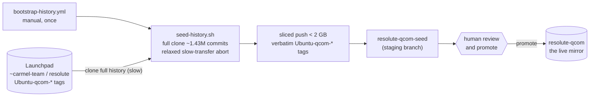
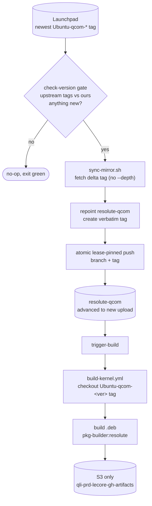

# Pipeline operations (maintainers)

How the mirror and build pipeline work, and the reasoning behind the parts that
are easy to break.

The pipeline has two halves: a **one-time bootstrap** that seeds the full history,
and the **incremental sync + build** that runs per upload thereafter.

## Repository branch layout

```
pkg-linux-qcom-canonical
│
├── main branch                       ← CI orchestrator: workflows, scripts, docs
│   ├── .github/workflows/
│   │   ├── fetch-source-pkg.yml      ← manual incremental mirror sync
│   │   ├── bootstrap-history.yml     ← one-time full-history seed
│   │   └── build-kernel.yml          ← build .deb packages
│   ├── scripts/
│   │   ├── sync-mirror.sh            ← incremental mirror-repoint (CI)
│   │   └── seed-history.sh           ← one-time full-history bootstrap (CI)
│   └── README.md
│
├── resolute-qcom branch              ← full-history mirror of the carmel-team tree (SYNC-ONLY)
│   └── ~1.4M commits; immutable tag per upload: Ubuntu-qcom-X.Y.Z-A.B (verbatim)
│
├── resolute-qcom-devel branch        ← developer integration branch (see INTEGRATION.md)
│
└── resolute-qcom-seed branch         ← transient bootstrap staging (only during a seed)
```

`resolute-qcom` shares **no history with `main`** (the CI orchestrator); it
carries the **complete upstream commit history** of the kernel it mirrors.

## Architecture and flow

### One-time bootstrap (run once, by hand)



Launchpad cannot serve shallow `--deepen`, so the seed is a single-shot **full**
clone; GitHub caps a push at 2 GB, so it is pushed in `< 2 GB` slices. The seed
lands on `resolute-qcom-seed` (never the live branch) for a human to promote.

### Incremental sync + build (per new upstream upload, manual dispatch)



The gate is a cheap two-call `ls-remote` (no clone). Because the branch already
holds full history, the per-upload fetch transfers only the delta, the push is
small, and the branch fast-forwards onto the new verbatim tag.

Sync jobs run on `ubuntu-24.04-arm` (GitHub-hosted). The build runs on the
`lecore-production` self-hosted runner (`lecore-prd-u2404-arm64-xlrg-od-ephem`).

## The mirror-repoint model and its guardrails

`resolute-qcom` is a **faithful mirror of the upstream Canonical kernel tree with
full commit history preserved**. Every upload is fetched with its real ancestry
and frozen under an immutable per-upload tag.

| Ref | Role |
|-----|------|
| **branch** `resolute-qcom` | A movable "latest Canonical" pointer. Disposable by design - force-advanced to each new upload. |
| **tag** `Ubuntu-qcom-X.Y.Z-A.B` | The upstream Canonical tag, mirrored **verbatim**. An **immutable** per-upload record; the sole anchor that preserves that upload's history (`git diff` between any two tags is a clean kernel delta). |

A sync is **pure fetch + repoint** ([`scripts/sync-mirror.sh`](../scripts/sync-mirror.sh)):
it only fast-forwards/repoints the mirror (no merge, no rebase), so it can never
conflict.

**Guardrails - do not "optimize" these away.** They are what keeps the ~1.43M-commit
history intact; several look redundant until the day they save the branch:

- **Never `--depth` / never shallow.** The incremental fetch and the seed must
  produce a complete, non-shallow closure. A shallow base breaks fetch negotiation,
  and GitHub rejects a shallow push outright.
- **Pinned lease, atomic push.** The branch + verbatim tag are pushed together with
  `--atomic` and `--force-with-lease=<ref>:<old-sha>` (never a bare
  `--force-with-lease`, never a blind `--force`). This prevents a tag-lands /
  branch-rejected split-brain and a concurrent run clobbering the branch.
- **Tag before moving the branch, ascending.** Every missing upload is tagged in
  version order before the branch advances past it, so a rebased middle upload is
  never silently dropped.
- **Never move a preservation tag.** A re-pointed upstream tag returns a non-zero
  "would clobber existing tag"; the sync surfaces it and refuses, rather than
  overwriting a frozen record.
- **Bare clone, fail-fast.** The mirror is operated as a bare repo (clean ref
  updates); any rejected push aborts the whole run so the next idempotent run can
  never mask a partial sync.
- **A freshly created branch is refused.** `sync-mirror.sh` aborts if the branch
  has fewer than `MIN_HISTORY_COMMITS` (1000) - i.e. it has not been seeded with
  real history yet. Run the bootstrap first.

### Launchpad and GitHub limits (hard-won)

- Launchpad's shallow `git fetch --deepen` path is **broken** (it stalls and throws
  `error processing shallow info`). It *can* serve a full clone, but spends several
  minutes computing the pack server-side, so the seed relaxes the git slow-transfer
  abort to ride out that quiet phase.
- GitHub caps a single push at **2 GB**, so the seed is pushed in `< 2 GB` slices.

## Upstream source and version discovery

The mirror tracks the carmel-team Qualcomm-Ubuntu kernel on Launchpad:
[https://git.launchpad.net/~carmel-team/ubuntu/+source/linux/+git/resolute](https://git.launchpad.net/~carmel-team/ubuntu/+source/linux/+git/resolute).

Version discovery is **purely git-tag based - there is no Launchpad REST API call**.
The upstream `Ubuntu-qcom-*` tag is the authoritative version source; the
`check-version` gate compares it against our mirrored tags. To check the newest
upstream upload directly, independent of the mirror:

```bash
git ls-remote --tags \
  https://git.launchpad.net/~carmel-team/ubuntu/+source/linux/+git/resolute \
  'refs/tags/Ubuntu-qcom-*' | sort -V | tail -1
# -> Ubuntu-qcom-7.0.0-1006.8   (example output)
```

## Bootstrapping

`resolute-qcom` must be **seeded with full history once** before the sync can run
incrementally. This is automated:

```bash
gh workflow run bootstrap-history.yml \
  --repo qualcomm-linux/pkg-linux-qcom-canonical
  # defaults: suite=resolute-qcom (seeds into the resolute-qcom-seed branch)
```

How it works ([`scripts/seed-history.sh`](../scripts/seed-history.sh)):

- **Single-shot full clone** of the full history (see
  [Launchpad and GitHub limits](#launchpad-and-github-limits-hard-won) for why
  shallow `--deepen` cannot be used).
- **Sliced push** in `< 2 GB` slices (the GitHub push cap, same section); the
  upstream `Ubuntu-qcom-*` tags are pushed **verbatim**.
- **Pushes to `resolute-qcom-seed`, never the live branch.** A human reviews and
  promotes it (the production `resolute-qcom` branch is too valuable to clobber
  automatically). The cloned repo is cached, so a retry after a failed publish
  skips re-downloading the multi-GB history.

Once seeded and promoted,
[`fetch-source-pkg.yml`](../.github/workflows/fetch-source-pkg.yml) keeps
`resolute-qcom` current; it **refuses to run against an un-seeded branch**.

## Running a sync

The sync takes **no inputs** - it always mirrors the latest carmel-team upload
into `resolute-qcom`:

```bash
gh workflow run fetch-source-pkg.yml \
  --repo qualcomm-linux/pkg-linux-qcom-canonical
# or: Actions → "Sync: Canonical Kernel Sources to Branch" → Run workflow
```

If the newest `Ubuntu-qcom-*` tag is already mirrored, the run exits cleanly
(idempotent). Otherwise it mirrors every un-mirrored upload in version order, then
triggers a build of the newest one.

## Manual build triggers

Trigger manually: **Actions → Build: Canonical Kernel .deb Packages → Run
workflow**. It builds the `resolute-qcom-devel` integration branch by default; set
`suite` to `resolute-qcom` to build the mirror instead. The `kernel_version` input
controls what is checked out:

| `kernel_version` | Source checked out | Use |
|------------------|--------------------|-----|
| *empty* | the selected branch HEAD (default `resolute-qcom-devel`) | build the current branch tip |
| `X.Y.Z-A.B` | the tag `Ubuntu-qcom-X.Y.Z-A.B` (validated first; fails fast if absent) | build an exact mirrored upload |

The only output is the `.deb` upload to **S3** (`lecore-production` runner). No
GitHub Actions artifacts and no GitHub Releases are produced.

## Workflows reference

### `fetch-source-pkg.yml` - Sync

Mirrors new upstream uploads into `resolute-qcom`, history-preserving, via
[`scripts/sync-mirror.sh`](../scripts/sync-mirror.sh).

- **Trigger**: manual `workflow_dispatch` only (no cron). **No inputs** - the
  upstream URL, branch, and tag prefix are fixed constants in the workflow.
- **Runner**: `ubuntu-24.04-arm` (all jobs).

| Job | What it does |
|-----|-------------|
| `check-version` | Two `ls-remote` calls (no clone): newest upstream `Ubuntu-qcom-*` tag vs our tags. Sets `should_sync`. |
| `sync` | Bare-clones our mirror; for each un-mirrored upload (ascending): fetches the upstream tag (delta only), advances `resolute-qcom`, and atomically pushes the branch + the verbatim tag (lease-pinned, fail-fast). Never merges/rebases. |
| `trigger-build` | Dispatches `build-kernel.yml` for the newest synced upload of the mirror (`suite=resolute-qcom`, `arch=arm64`, `flavor=qcom`, `runner=lecore-production`). |

Idempotent: if the newest upload is already mirrored, the run exits without cloning
anything.

### `build-kernel.yml` - Build

Checks out the kernel source (a verbatim tag, or the branch HEAD) and builds `.deb`
packages inside the base-suite-matched
`ghcr.io/qualcomm-linux/pkg-builder:<base_suite>` container.

- **Trigger**: dispatched by the sync, or manually.
- **Output**: **S3 only** (`lecore-production` runner). No artifacts, no releases.

| Input | Default | Description |
|-------|---------|-------------|
| `suite` | `resolute-qcom-devel` | Branch to build from; base suite (`resolute`) derived for container selection. |
| `kernel_version` | *(empty)* | Builds the exact `Ubuntu-qcom-<version>` tag (validated first). Empty = branch HEAD. |
| `arch` | `arm64` | Target architecture. |
| `flavor` | `qcom` | Kernel flavour. **`qcom` is the only flavour this tree builds** (`generic`/`lowlatency` do not exist for the qcom derivative). `all` builds `qcom` + `qcom-rt`. |
| `runner` | `ubuntu-24.04-arm` | `ubuntu-24.04-arm` (hosted, no S3), `self-hosted`, or `lecore-production` (the only runner that uploads to S3). |

**Build steps**:
1. Free disk space.
2. Checkout the tag/branch → `kernel-src/`.
3. Checkout `qualcomm-linux/docker-pkg-build@main`.
4. Derive `BASE_SUITE` (`resolute-qcom` → `resolute`).
5. Build the image: `docker_deb_build.py --rebuild -d <base_suite>`.
6. In-container: `apt-get build-dep linux`; `fakeroot make -f debian/rules clean`;
   `fakeroot debian/rules binary-<flavor> do_skip_checks=true`
   (see [Build container notes](#build-container-notes)).
7. Collect `.deb` files and upload to S3.

**Self-hosted runner requirements** (`lecore-production`): Ubuntu 24.04 arm64,
Docker (runner user in the `docker` group), ≥ 25 GB free disk.

## The CI scripts

| Script | Purpose | Used by |
|--------|---------|---------|
| `scripts/sync-mirror.sh` | Incremental history-preserving mirror-repoint of new uploads | `fetch-source-pkg.yml` |
| `scripts/seed-history.sh` | One-time full-history bootstrap of `resolute-qcom-seed` | `bootstrap-history.yml` |

`scripts/check-version.sh`, `scripts/fetch-source-pkg.sh`, and
`scripts/build-kernel-deb.sh` are **legacy** standalone local helpers that predate
the mirror model; they are **not** part of the CI path.

## Build container notes

### Build environment setup (`debian/rules clean`)

Before compilation the build runs `fakeroot make -f debian/rules clean`, the
standard Ubuntu kernel build setup path. The `clean` target:

- Runs `debian/control` as a dependency, generating **`debian/canonical-certs.pem`**
  (the X.509 cert the kernel's `certs/x509_certificate_list` target requires -
  without it the build fails immediately) and **`debian/control`**.
- Creates **`debian/changelog`** (the active derivative's changelog,
  `debian.qcom/changelog`). `dh_installchangelogs`, run at the end of
  `binary-qcom`, fails without it - after 2+ hours of compilation.
- Removes stale build artifacts.

**Why `fakeroot make -f debian/rules` and not `fakeroot debian/rules`?**
`fakeroot` execs the command via `/bin/sh` (dash), which resolves the
`#!/usr/bin/make -f` shebang at exec time; in the container that resolution fails
silently with `debian/rules: not found (exit 127)`. Passing `make -f debian/rules`
explicitly bypasses the shebang lookup.

### Skipping the config policy check (`do_skip_checks=true`)

The Ubuntu kernel build runs a config-policy check (`annotations --check`) that
expects `CONFIG_RUST_IS_AVAILABLE=y`. In the `pkg-builder` container `bindgen` is
unavailable, so `olddefconfig` drops that symbol and the policy diff fails. Passing
`do_skip_checks=true` bypasses the check - the standard approach for non-official
builds where optional toolchains are absent.

## License

See the [main README](../README.md#license): BSD 3-Clause for the CI scripts and
workflows, GPL-2 for the mirrored kernel source.
