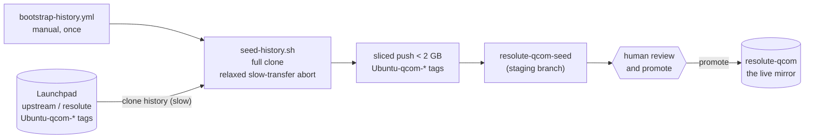
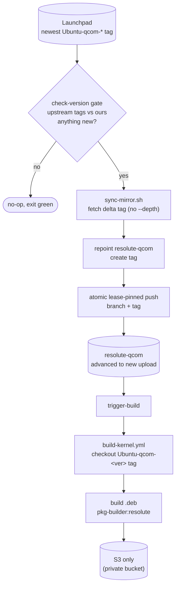

# Pipeline operations (maintainers)

How the mirror and build pipeline work, and the reasoning behind the parts that
are easy to break.

The pipeline has two halves: a **one-time bootstrap** that seeds the history, and
the **incremental sync + build** that runs per upload thereafter.

## Repository branch layout

```
pkg-linux-qcom-canonical
│
├── main branch                       ← CI orchestrator: workflows, scripts, docs
│   ├── .github/workflows/
│   │   ├── fetch-source-pkg.yml      ← manual incremental mirror sync
│   │   ├── bootstrap-history.yml     ← one-time history seed
│   │   └── build-kernel.yml          ← build .deb packages (+ reusable workflow_call)
│   ├── scripts/
│   │   ├── sync-mirror.sh            ← incremental mirror-repoint (CI)
│   │   └── seed-history.sh           ← one-time history bootstrap (CI)
│   └── README.md
│
├── resolute-qcom branch              ← upstream Ubuntu kernel mirror (SYNC-ONLY)
│   └── immutable tag per upload: Ubuntu-qcom-X.Y.Z-A.B
│
├── resolute-qcom-devel branch        ← developer integration branch (see INTEGRATION.md)
│   └── .github/workflows/premerge-pr.yml  ← pre-merge PR build check (lives here, not on main)
│
└── resolute-qcom-seed branch         ← transient bootstrap staging (only during a seed)
```

`resolute-qcom` shares **no history with `main`** (the CI orchestrator); it holds
the upstream kernel tree the packages are built from.

## Architecture and flow

### One-time bootstrap (run once, by hand)



Launchpad cannot serve shallow `--deepen`, so the seed is a single-shot **full**
clone; GitHub caps a push at 2 GB, so it is pushed in `< 2 GB` slices. The seed
lands on `resolute-qcom-seed` (never the live branch) for a human to promote.

### Incremental sync + build (per new upstream upload, manual dispatch)



The gate is a cheap two-call `ls-remote` (no clone). Because the branch already
holds full history, the per-upload fetch transfers only the delta, the push is
small, and the branch fast-forwards onto the new tag.

Sync jobs run on `ubuntu-24.04-arm` (GitHub-hosted). The build runs on a
self-hosted arm64 runner.

## The mirror-repoint model and its guardrails

`resolute-qcom` mirrors the upstream Ubuntu kernel tree. Every upload is fetched
with its history and frozen under an immutable per-upload tag.

| Ref | Role |
|-----|------|
| **branch** `resolute-qcom` | A movable "latest upstream" pointer. Disposable by design - force-advanced to each new upload. |
| **tag** `Ubuntu-qcom-X.Y.Z-A.B` | The upstream tag, kept as an **immutable** per-upload record; the sole anchor that preserves that upload's history (`git diff` between any two tags is a clean kernel delta). |

A sync is **pure fetch + repoint** ([`scripts/sync-mirror.sh`](../scripts/sync-mirror.sh)):
it only fast-forwards/repoints the mirror (no merge, no rebase), so it can never
conflict.

**Guardrails - do not "optimize" these away:**

- **Never shallow.** Fetches and the seed must be a complete, non-shallow closure;
  a shallow base breaks fetch negotiation and GitHub rejects a shallow push.
- **Atomic, lease-pinned push.** The branch and its tag are pushed together with
  `--atomic` and `--force-with-lease=<ref>:<old-sha>`, so a concurrent run cannot
  clobber the branch or leave a tag/branch split-brain.
- **Tag before advancing, never move a tag.** Each upload is tagged in version
  order before the branch moves past it, and re-pointing an existing tag is
  refused, so no upload is silently dropped or overwritten.
- **Refuse an un-seeded branch.** The sync aborts if the branch has fewer than
  `MIN_HISTORY_COMMITS` commits; run the bootstrap first.

### Launchpad and GitHub limits

- Launchpad cannot serve a shallow `git fetch --deepen` (it stalls); it serves only
  a full clone and computes the pack slowly, so the seed relaxes git's slow-transfer
  abort to ride out that phase.
- GitHub caps a single push at **2 GB**, so the seed is pushed in `< 2 GB` slices.

## Upstream source and version discovery

The mirror tracks the upstream Qualcomm Ubuntu kernel on Launchpad:
[https://git.launchpad.net/~carmel-team/ubuntu/+source/linux/+git/resolute](https://git.launchpad.net/~carmel-team/ubuntu/+source/linux/+git/resolute).

Version discovery is **purely git-tag based - there is no Launchpad REST API call**.
The upstream `Ubuntu-qcom-*` tag is the authoritative version source; the
`check-version` gate compares it against our mirrored tags. To check the newest
upstream upload directly, independent of the mirror:

```bash
git ls-remote --tags \
  https://git.launchpad.net/~carmel-team/ubuntu/+source/linux/+git/resolute \
  'refs/tags/Ubuntu-qcom-*' | sort -V | tail -1
# -> Ubuntu-qcom-7.0.0-1006.8   (example output)
```

## Bootstrapping

`resolute-qcom` must be **seeded once** before the sync can run incrementally. This
is automated:

```bash
gh workflow run bootstrap-history.yml \
  --repo qualcomm-linux/pkg-linux-qcom-canonical
  # defaults: suite=resolute-qcom (seeds into the resolute-qcom-seed branch)
```

How it works ([`scripts/seed-history.sh`](../scripts/seed-history.sh)): a
single-shot full clone (shallow `--deepen` is unavailable, see
[Launchpad and GitHub limits](#launchpad-and-github-limits)), pushed to
`resolute-qcom-seed` in `< 2 GB` slices with the upstream `Ubuntu-qcom-*` tags. A
human reviews and promotes it to the live branch; the clone is cached, so a failed
publish can be retried without re-downloading.

Once seeded and promoted,
[`fetch-source-pkg.yml`](../.github/workflows/fetch-source-pkg.yml) keeps
`resolute-qcom` current; it **refuses to run against an un-seeded branch**.

## Running a sync

The sync takes **no inputs** - it always mirrors the latest upstream upload into
`resolute-qcom`:

```bash
gh workflow run fetch-source-pkg.yml \
  --repo qualcomm-linux/pkg-linux-qcom-canonical
# or: Actions → "Sync: Canonical Kernel Sources to Branch" → Run workflow
```

If the newest `Ubuntu-qcom-*` tag is already mirrored, the run exits cleanly
(idempotent). Otherwise it mirrors every un-mirrored upload in version order, then
triggers a build of the newest one.

## Manual build triggers

Trigger manually: **Actions → Build: Canonical Kernel .deb Packages → Run
workflow**. It builds the `resolute-qcom-devel` integration branch by default; set
the **Branch to build from** field to `resolute-qcom` to build from the mirror branch instead. The `kernel_version` input
controls what is checked out:

| `kernel_version` | Source checked out | Use |
|------------------|--------------------|-----|
| *empty* | the selected branch HEAD (default `resolute-qcom-devel`) | build the current branch tip |
| `X.Y.Z-A.B` | the tag `Ubuntu-qcom-X.Y.Z-A.B` (validated first; fails fast if absent) | build an exact mirrored upload |

The only output is the `.deb` upload to **S3**. No GitHub Actions artifacts and no
GitHub Releases are produced.

## Workflows reference

### `fetch-source-pkg.yml` - Sync

Mirrors new upstream uploads into `resolute-qcom`, history-preserving, via
[`scripts/sync-mirror.sh`](../scripts/sync-mirror.sh).

- **Trigger**: manual `workflow_dispatch` only (no cron). **No inputs** - the
  upstream URL, branch, and tag prefix are fixed constants in the workflow.
- **Runner**: `ubuntu-24.04-arm` (all jobs).

| Job | What it does |
|-----|-------------|
| `check-version` | Two `ls-remote` calls (no clone): newest upstream `Ubuntu-qcom-*` tag vs our tags. Sets `should_sync`. |
| `sync` | Bare-clones our mirror; for each un-mirrored upload (ascending): fetches the upstream tag (delta only), advances `resolute-qcom`, and atomically pushes the branch + the tag (lease-pinned, fail-fast). Never merges/rebases. |
| `trigger-build` | Dispatches `build-kernel.yml` for the newest synced upload of the mirror (`suite=resolute-qcom`, `kernel_version=<synced version>`). |

Idempotent: if the newest upload is already mirrored, the run exits without cloning
anything.

### `build-kernel.yml` - Build

Checks out the kernel source (a tag, or the branch HEAD) and builds `.deb`
packages inside the base-suite-matched
`ghcr.io/qualcomm-linux/pkg-builder:<base_suite>` container.

- **Trigger**: dispatched by the sync, or manually.
- **Output**: **S3 only**. No artifacts, no releases.

| Input | Default | Trigger | Description |
|-------|---------|---------|-------------|
| `suite` | `resolute-qcom-devel` | dispatch + call | Branch to build from; base suite (`resolute`) derived for container selection. |
| `kernel_version` | *(empty)* | dispatch + call | Builds the exact `Ubuntu-qcom-<version>` tag (validated first). Empty = branch HEAD. |
| `devel_prs` | *(empty)* | dispatch + call | Space-separated PR numbers against `resolute-qcom-devel` to merge before building (e.g. `42 43`). Conflict aborts with a clear error. |
| `ref` | *(empty)* | call only | Exact git ref to checkout, overrides `suite`/`kernel_version` when set. Used by `premerge-pr.yml` to build the PR merge ref. |
| `skip_s3` | `false` | call only | Skip the S3 upload step. Used by `premerge-pr.yml` so premerge builds are build-only and never upload. |

**Build steps**:
1. Free disk space.
2. Checkout the tag/branch (or `ref` if set) → `kernel-src/`.
3. If `devel_prs` is set: merge each PR against `resolute-qcom-devel` into `kernel-src/` (conflict aborts).
4. Checkout `qualcomm-linux/docker-pkg-build@main`.
5. Derive `BASE_SUITE` (`resolute-qcom` → `resolute`).
6. Build the image: `docker_deb_build.py --rebuild -d <base_suite>`.
7. In-container: `apt-get build-dep linux`; `fakeroot make -f debian/rules clean`;
   `fakeroot debian/rules binary-<flavor> do_skip_checks=true`
   (see [Build container notes](#build-container-notes)).
8. Collect `.deb` files and upload to S3 (skipped when `skip_s3=true`).

**Self-hosted runner requirements**: Ubuntu 24.04 arm64, Docker (runner user in the
`docker` group), ≥ 25 GB free disk.

### Pre-merge validation

The `premerge-pr.yml` check gives every PR into `resolute-qcom-devel` a build-only
kernel build as a status check. It builds the PR's **merge ref** (the PR as it would look merged into the
current branch HEAD) and uploads nothing (`skip_s3=true`).

- **Trigger**: `pull_request` on `resolute-qcom-devel` (opened, synchronize,
  reopened), run via `build-kernel.yml`'s `workflow_call` interface.
- **Where it lives**: GitHub resolves `pull_request` workflows from the PR's
  **base branch** - here `resolute-qcom-devel`, which is a kernel tree carrying
  none of `main`'s workflows. (Base equals the default branch only in the common
  case; here they differ, so a workflow on `main` alone would never fire.) So the
  workflow lives **on the integration branch itself**, at
  `resolute-qcom-devel:.github/workflows/premerge-pr.yml` - a thin caller that
  invokes `build-kernel.yml@main`, so no build logic lives on the kernel branch.
  It is added and maintained by its own PR into `resolute-qcom-devel` (it is
  **not** carried on `main`); the reference copy is below.
- **Security**: it uses `pull_request`, **not** `pull_request_target`, so the run
  has a read-only token and no secrets, and it builds the merge ref rather than a
  raw PR head. Builds are build-only (`skip_s3=true`) and upload nothing. Fork PRs
  require maintainer approval before any workflow runs (Settings > Actions > Fork
  pull request workflows).
- **Concurrency**: one build per PR; a new push cancels the in-progress build.

Before the check is added: `main` must already carry the `workflow_call` interface,
and the repo must have **"Require approval for all fork pull requests"** enabled
(see Security above). To make the check blocking, add **`Build check / Build`** as a
required status check on the `resolute-qcom-devel` ruleset.

<details>
<summary>Reference: <code>resolute-qcom-devel:.github/workflows/premerge-pr.yml</code></summary>

Copy this onto `resolute-qcom-devel` (via a PR into that branch) to add or restore
the check.

```yaml
# SPDX-License-Identifier: BSD-3-Clause
#
# premerge-pr.yml - pre-merge validation build for resolute-qcom-devel.
# Lives on resolute-qcom-devel (GitHub resolves pull_request workflows from the PR
# base branch). Thin caller of the reusable build-kernel.yml on main. Contributor
# PRs come from forks, so the repo must enable "Require approval for all fork pull
# requests". Rationale + security note: docs/PIPELINE.md#pre-merge-validation.

name: "Pre-merge PR build"

on:
  pull_request:
    branches:
      - resolute-qcom-devel
    types: [opened, synchronize, reopened]

permissions:
  contents: read

concurrency:
  group: premerge-pr-${{ github.event.pull_request.number }}
  cancel-in-progress: true

jobs:
  build:
    name: "Build check"
    uses: qualcomm-linux/pkg-linux-qcom-canonical/.github/workflows/build-kernel.yml@main
    with:
      suite: resolute-qcom-devel
      ref: refs/pull/${{ github.event.pull_request.number }}/merge
      skip_s3: true
```
</details>

## The CI scripts

| Script | Purpose | Used by |
|--------|---------|---------|
| `scripts/sync-mirror.sh` | Incremental history-preserving mirror-repoint of new uploads | `fetch-source-pkg.yml` |
| `scripts/seed-history.sh` | One-time history bootstrap of `resolute-qcom-seed` | `bootstrap-history.yml` |

`scripts/check-version.sh`, `scripts/fetch-source-pkg.sh`, and
`scripts/build-kernel-deb.sh` are **legacy** standalone local helpers that predate
the mirror model; they are **not** part of the CI path.

## Build container notes

A few build steps look odd but are load-bearing:

- **`fakeroot make -f debian/rules clean` before compiling** (note `make -f`, not a
  bare `debian/rules`): the standard Ubuntu kernel setup path. It generates the
  signing cert, `debian/control`, and the derivative `debian/changelog` that later
  targets require, and clears stale artifacts. The explicit `make -f` avoids a
  shebang-resolution failure that otherwise aborts the build inside the container.
- **`do_skip_checks=true`**: the config-policy check expects
  `CONFIG_RUST_IS_AVAILABLE=y`, but `bindgen` is absent in the container so the
  symbol drops and the check fails. Skipping it is the standard approach for
  non-official builds where optional toolchains are missing.

## License

See the [main README](../README.md#license): BSD 3-Clause for the CI scripts and
workflows, GPL-2 for the mirrored kernel source.
